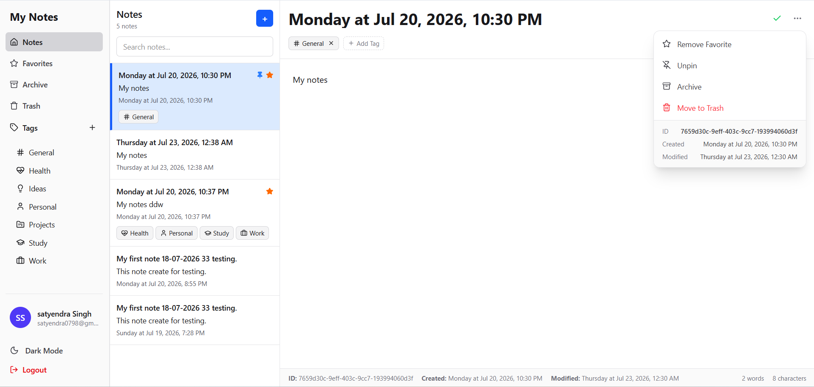

# 📝 Notes Management System (Microservices)

A production-ready **Notes Management System** built using a Microservices architecture with **Node.js, Express.js, PostgreSQL, Prisma, Redis, React, Docker, and Docker Compose**.

---


# Architecture

```
                    +----------------+
                    |   React (UI)   |
                    |  Vite + React  |
                    +-------+--------+
                            |
                            |
                    http://localhost:8000
                            |
                    +-------v--------+
                    |  API Gateway   |
                    |    Express     |
                    +---+--------+---+
                        |        |
          --------------+        +--------------
          |                                 |
+---------v---------+           +-----------v---------+
|   Auth Service    |           |    Notes Service    |
| Express + Prisma  |           | Express + Prisma    |
+---------+---------+           +-----------+---------+
          |                                 |
+---------v---------+           +-----------v---------+
| PostgreSQL(Auth)  |           | PostgreSQL(Notes)   |
+-------------------+           +---------------------+

                     +----------------+
                     |     Redis      |
                     |     Cache      |
                     +----------------+
```

---

# Tech Stack

## Backend

- Node.js
- Express.js
- Prisma ORM
- PostgreSQL
- Redis
- JWT Authentication
- Docker

## Frontend

- React
- Vite
- Axios
- TailwindCSS
- Lucide Icons

---

# Project Structure

```
notes-microservices/
│
├── frontend/
│
├── gateway/
│
├── auth-service/
│
├── notes-service/
│
├── docker-compose.yml
│
├── .env
│
└── README.md
```

---

# Services

| Service | Port |
|----------|------|
| Frontend | 5173 |
| API Gateway | 8000 |
| Auth Service | 8081 |
| Notes Service | 8082 |
| Auth PostgreSQL | 5432 |
| Notes PostgreSQL | 5433 |
| Redis | 6379 |

---

# Features

## Authentication

- User Registration
- Login
- JWT Authentication
- Password Hashing (bcrypt)

---

## Notes

- Create Note
- Edit Note
- Delete Note
- Soft Delete
- Restore Note
- Archive
- Favorite
- Pin
- Search
- Tags

---

## Tags

- Create Tag
- Update Tag
- Delete Tag
- Assign Tags
- Filter by Tag

---

## Redis

Caching

- Single Note
- Notes List
- Tags

Automatic cache invalidation

---

# Environment Variables

Create a root `.env`

```env
POSTGRES_VERSION=17

#########################################
# Gateway
#########################################

GATEWAY_PORT=8000

#########################################
# Auth Service
#########################################

AUTH_SERVICE_PORT=8081

AUTH_DB_PORT=5432
AUTH_DB_USER=postgres
AUTH_DB_PASSWORD=password
AUTH_DB_NAME=notes_auth

#########################################
# Notes Service
#########################################

NOTES_SERVICE_PORT=8082

NOTES_DB_PORT=5433
NOTES_DB_USER=postgres
NOTES_DB_PASSWORD=password
NOTES_DB_NAME=notes_db

#########################################
# Redis
#########################################

REDIS_PORT=6379

#########################################
# JWT
#########################################

JWT_SECRET=my-secret-key
```

---

# Docker Setup

Build everything

```bash
docker compose build
```

Start

```bash
docker compose up
```

Detached

```bash
docker compose up -d
```

Stop

```bash
docker compose down
```

---

# Install Dependencies

## Gateway

```bash
cd gateway

npm install
```

---

## Auth Service

```bash
cd auth-service

npm install
```

---

## Notes Service

```bash
cd notes-service

npm install
```

---

## Frontend

```bash
cd frontend

npm install
```

---

# Prisma Setup

## Auth Service

Generate Prisma Client

```bash
cd auth-service

npx prisma generate
```

Run Migration

```bash
npx prisma migrate dev --name init
```

---

## Notes Service

Generate Prisma Client

```bash
cd notes-service

npx prisma generate
```

Run Migration

```bash
npx prisma migrate dev --name init
```